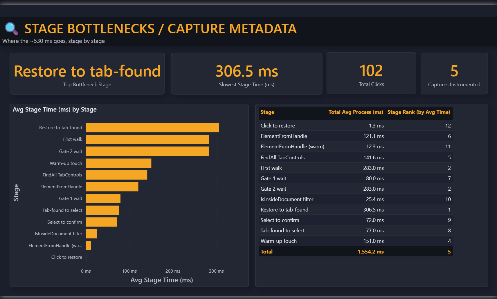

# Peekbar

An OS-integrated browser state management layer that exposes
persistent browser state through taskbar-integrated controls, enabling
low-latency context switching and automation workflows, with event-driven
telemetry and performance instrumentation over Windows tracing APIs.

Minimizing a browser window normally collapses it into a flat taskbar button,
and everything you were looking at disappears. `Peekbar` adds a
**dock strip in the taskbar's own empty gap area**, where minimized browser
windows leave their tabs behind as hoverable chips. Multiple minimized
windows stack up as staggered cards, plus one-click launcher buttons for
sites and shortcuts you use often.

> **Status:** working on Windows 11. Core dock, multi-window tab tracking,
> and taskbar launcher buttons are implemented and accepted end-to-end.
> Actively developed.

<p align="center">
  <br>
  <em>Hover a chip to fan out a window's tabs, click to restore, launch a project into a terminal, and watch minimized windows aggregate, all in the taskbar's empty gap.</em>
</p>

<p align="center">
  <br>
  <em>Launcher pills open your sites and projects in one click, straight from the taskbar gap.</em>
</p>

## Why

Browser tab hoarders lose track of what's in a minimized window. This tool
doesn't manage your tabs or replace your browser; it just keeps a glance-able
trace of them visible in space the taskbar already wastes.

## Is this safe to run?

It reads tab *titles* only (not full URLs), never injects into other
processes, and never talks to the network. Full breakdown: [`SECURITY.md`](SECURITY.md).

## Install

### Grab the ZIP and run

Build the distributable once, then it's just unzip-and-run — no installer, no
admin rights, no dependencies:

```
cmake -B build -G "Visual Studio 17 2022"
cmake --build build --config Release
cpack --config build/CPackConfig.cmake -G ZIP   # -> build/dist/Peekbar-1.0.0-win64.zip
```

Unzip anywhere and double-click `peekbar.exe`. It runs as a hidden coordinator
window, draws its strip in the taskbar gap, and has no taskbar button of its
own. Stop it by ending `peekbar.exe` from Task Manager.

**Start at logon (optional).** From the unzipped folder:

```
powershell -ExecutionPolicy Bypass -File .\install.ps1     # copy to %LOCALAPPDATA%\Peekbar + HKCU autostart
powershell -ExecutionPolicy Bypass -File .\uninstall.ps1   # undo (per-user only, no admin)
```

Autostart is per-user (HKCU `...\CurrentVersion\Run`) — nothing system-wide,
nothing that needs elevation. The in-zip `README.txt` has the full quickstart
and `config.sample.txt` documents the launcher-button format.

### Build from source

**Prerequisites:** Windows 10/11 x64, Visual Studio 2022 (Desktop development
with C++ workload) or Build Tools + CMake ≥ 3.20.

```
cmake -B build -G "Visual Studio 17 2022"
cmake --build build --config Release
build\Release\peekbar.exe
```

Nothing is written outside the build folder; delete the `.exe` to remove it.

## Stack

- **C++23 / Win32**
- **UI Automation** for reading tab titles (self-contained; no browser
  extension required).
- Per-monitor DPI aware.

## Roadmap

| Stage | Deliverable | Status |
|---|---|---|
| **1** | Hello-world shell tool: a dock anchored above the taskbar. | ✅ |
| **2** | Detect an open browser and perform a simple action in the dock. | ✅ |
| **3** | Track one browser's tabs; keep them on-screen after minimize. | ✅ |
| **4** | Track multiple browsers; aggregate as a staggered card stack. | ✅ |
| **5** | Taskbar launcher buttons for sites and shortcuts, persisted with the shell. | ✅ |
| **P** | `shell_profiler`, a separate, never-bundled ETW-based perf observability tool. | ✅ |

How it works, in depth: [`docs/`](docs/).

## Performance & observability

Tab-restore felt slow, so I instrumented the path with a separate ETW-based
profiler (`shell_profiler`) and used a git-diffable Power BI dashboard to guide
the work. `restore→tab-found` was the dominant cost. Guided passes took the
path from 602 ms to 271 ms across 5 capture runs (102 clicks). Details:
[`docs/dashboard/`](docs/dashboard/) and [`profiler/`](profiler/).

That measurement pointed at the UIA tree-walk itself, so activation was
ultimately rebuilt to skip UIA on the hot path entirely: a ring-hop planner
that computes the shortest keystroke sequence to the target tab and sends it as
one batched `SendInput`. Median tab activation dropped from 539 ms (the UIA
walk) to ~95 ms — 5.7× — with the injection step collapsing from ~137 ms to
~20 ms (`KeystrokeHopLatency`).

<p align="center">
  <br>
  <em>Per-stage latency breakdown. <code>restore&rarr;tab-found</code> dominates. Full dashboard in <a href="docs/dashboard/">docs/dashboard/</a>.</em>
</p>
