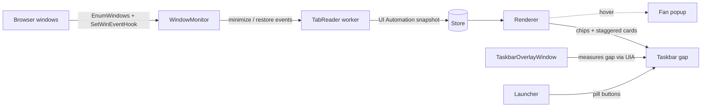

# How Peekbar works

A one-page tour of the design. For the pitch and install steps, start at the
[README](../README.md).

The tool is a hidden coordinator process with no visible main window and no
taskbar icon. It watches browser windows, reads their tabs, and paints chips
into the taskbar's own empty gap. Everything is native C++23 and Win32, with no
frameworks, no Electron, no web view, and no third-party dependencies.

## Data flow

## Discovering browser windows

`WindowMonitor` finds browser frames with `EnumWindows` and tracks their
lifecycle with `SetWinEventHook`. It is fully event-driven, so idle CPU sits
near zero with no polling loop.

The filter keeps real Chromium frames and drops helpers: window class
`Chrome_WidgetWin_1`, visible, unowned, non-empty title, and a process image of
`chrome.exe` or `msedge.exe`. Hook callbacks arrive on arbitrary threads, so
they do the minimum and post the work to the UI thread.

## Reading tabs

`TabReader` reads tab titles through UI Automation. It calls `ElementFromHandle`
on the browser window, finds the tab strip (`UIA_TabControlTypeId` with
`UIA_TabItemControlTypeId` children), and pulls every `Name` in one cross-process
round trip via a cache request.

The snapshot is taken on `EVENT_SYSTEM_MINIMIZESTART`, while the tree is still
live, and stored in `Store`. Chips render from that stored snapshot, so they
stay correct even after Chromium suspends a minimized window's tree.

UI Automation exposes tab titles but not background-tab URLs. That limit is
accepted, and the upgrade path below removes it if it ever bites.

## Rendering chips and the fan

`Renderer` paints one chip per tab. Multiple minimized windows stack as
staggered cards, newest on top, with a `+N` count when they overflow the row.

Hovering a card opens a fan: a transient topmost layered popup that expands
upward above the taskbar and dismisses on leave. Clicking a chip restores that
exact window with `ShowWindow(SW_RESTORE)` and `SetForegroundWindow`.

Clicking a specific tab row restores the window and then activates that tab
without touching UI Automation: a ring-hop planner computes the shortest
keystroke path to the target on the wrapping tab ring and the worker sends it as
one batched `SendInput`. This replaced an earlier UIA walk-and-select and cut
median activation from 539 ms to ~95 ms.

## Claiming the taskbar gap

Windows 11 removed the toolbar extension APIs, so nothing can be injected into
the taskbar safely. `TaskbarOverlayWindow` instead sits over the taskbar's empty
strip as a topmost overlay.

It finds the taskbar (`Shell_TrayWnd`) and measures the gap between the end of
the task-button list and the tray through UI Automation over the taskbar's
element tree. It re-measures when buttons appear or disappear
(`EVENT_OBJECT_LOCATIONCHANGE`) and on display or DPI changes.

Outside its own buttons the overlay is click-through (`WM_NCHITTEST` returns
`HTTRANSPARENT`), so normal taskbar behavior is untouched.

## Launcher buttons

`Launcher` renders pill buttons in the same gap for quick actions: open a URL,
open a pinned site, or run a shortcut or command. Actions use `ShellExecuteW`
and `CreateProcessW`.

Button definitions live in a pipe-delimited text config
(`style|label|action|target`) under `%LOCALAPPDATA%\Peekbar`, loaded at startup
and hot-reloaded on change via `ReadDirectoryChangesW`.

## Design stance

One UI thread owns every window and is the sole writer to `Store`. Blocking work
(UI Automation, window enumeration) runs on worker threads that communicate only
by `PostMessage`.

The tool is per-monitor-DPI-v2 aware and re-measures on `WM_DPICHANGED` and
`WM_DISPLAYCHANGE`. The two fragile heuristics, reading the browser tab tree and
measuring the taskbar gap, are isolated in `TabReader` and
`TaskbarOverlayWindow`, so a browser or Windows update is a one-file fix.

## Observability

The shell instruments itself with ETW TraceLogging under the provider
`Peekbar.Perf`. When no session is listening, events are discarded at
near-zero cost, so there are no log files and no telemetry threads.

A separate tool, [`shell_profiler`](../profiler/), consumes those events into a
live metrics table, and a [Power BI dashboard](dashboard/) analyzes the
tab-restore latency captures.

## Where UI Automation stops

If the UIA limits matter (no background-tab URLs, occasional tree fragility), the
replacement is the browsers' native messaging mechanism. A WebExtension reports
exact titles, URLs, and favicons to a small native host.

That host becomes an alternative implementation behind the `TabReader`
interface. `Store`, `Renderer`, `WindowMonitor`, and `Launcher` stay untouched.
