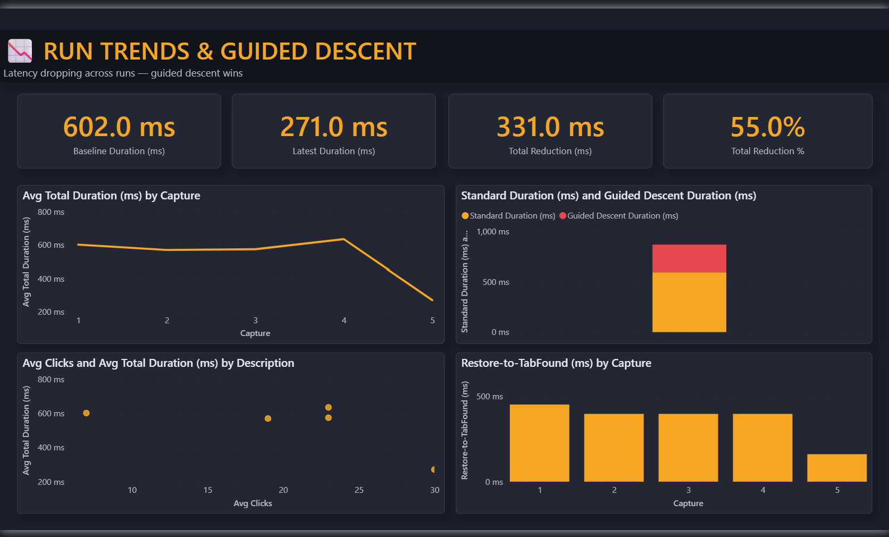

# Fan-activate latency dashboard

Power BI dashboard over the `shell_profiler` `FanActivateLatency` captures.
Visualizes where the tab-restore latency goes and how it dropped across five
capture runs (602 ms → 271 ms via guided descent).

> **Why PBIP:** the whole dashboard is checked into version control as text
> (TMDL model + PBIR report), so its changes review in a pull request like code:
> no binary `.pbix` blob to diff.

## What it shows

   
  <em>Overview: average total 530.6 ms (fastest run 271 ms) across 5 capture runs / 102 clicks. <code>restore&rarr;tab-found</code> is the dominant stage.</em>

   
  <em>Where the per-run latency goes, stage by stage: <code>restore&rarr;tab-found</code> tops at 306.5 ms. Caveat: <code>First walk</code> and <code>Gate 2 wait</code> both read 283 ms (the same physical interval measured two ways), so the per-stage total (1,554 ms) double-counts 283 ms. Total-latency figures are unaffected.</em>

   
  <em>Guided descent: baseline 602 ms &rarr; latest 271 ms (&minus;331 ms, 55%) across five capture runs. Run count: 5, each aggregating ~20 clicks (102 total).</em>

> Figures dark-theme. Generated from the 2026-07 capture runs, with per-run
> notes in the `CaptureMeta` table. Regenerate by opening the pbip below and
> using **Home &rarr; Refresh**.

### Ring-Hop Era page

A fourth page, **Ring-Hop Era**, covers the keystroke ring-hop planner that
replaced the UIA walk on the hot path. It reads from three separate tables
(`HopStrategies`, `HopStages`, `HopDist`) so the UIA-era measures above stay
untouched. It shows:

- **Median latency by strategy** &mdash; the A/B/C/D bake-off: UIA walk 539 ms,
  spaced relative 578 ms, absolute jump 252 ms, batched relative 303 ms, optimal
  ring-hop **95 ms** (5.7&times; vs UIA). Endpoint caveat: keystroke medians end
  at keys-sent; the UIA baseline includes its ~72 ms confirm settle, so the bar
  is a like-for-like ranking of the medians, not a settle-normalized one.
- **Where the ~83 ms goes** &mdash; `restore &rarr; foreground-ready` (62 ms, the
  OS un-minimize floor) dwarfs `ready &rarr; keys-sent` injection (20 ms).
  Injection is solved; the restore floor is what remains.
- **Keystrokes per click** &mdash; the planner's hop-count distribution
  (median 3, capped at 9 by anchoring vs 22 for a naive relative walk).

> No PNG is committed for this page yet: it renders on the next **Home &rarr;
> Refresh** in Power BI Desktop on Windows. Data source: the committed
> `captures/capture_optimal*.txt` runs, analyzed in
> `captures/ANALYSIS_optimal.md`.

## Open it
Open `Logging_shell_real.pbip` in Power BI Desktop (needs the **"Store reports using enhanced metadata
format (PBIR)"** preview feature enabled to re-save). On first open, click **Home → Refresh** to populate
the calculated tables, then **Ctrl+S**.

## Layout
- **Format:** PBIP, text-only. Model is TMDL (`*.SemanticModel/definition/`), report is PBIR
  (`*.Report/definition/`). No `.pbix` binary blob, so it diffs and merges in git.
- **Data:** self-contained. Every fact table is an inline `DATATABLE` calculated table (no external
  source, no refresh dependency), so the PBIP stays diffable and does not read the CSV. Figures are
  the per-run aggregates. One representative raw per-click run (7 clicks, baseline) is kept at
  `profiler/captures/fan_activate_breakdown_long.csv`; the full 102-click corpus was not retained.
- **Pages:** Latency Overview · Stage Bottlenecks / Capture Metadata · Run Trends & Guided Descent · Ring-Hop Era.
- **Tables:** UIA era &mdash; `Captures` (per-run), `SubFields` (per-stage), `CaptureMeta` (per-run
  instrumentation notes). Ring-hop era &mdash; `HopStrategies` (strategy bake-off), `HopStages`
  (restore vs injection split), `HopDist` (keystrokes-per-click distribution).
- **Theme:** `Logging_shell_real.Report/StaticResources/RegisteredResources/LatencyDark.json` (dark).

## Notes
- Sample: 5 capture runs / 102 clicks.
- Not committed: `.pbi/localSettings.json`, `cache.abf` (see `.gitignore`).
- Known data caveat: Capture 2's `us_gate2_wait` and `us_first_walk` are the same physical time measured
  two ways, currently listed as two stages, so per-stage totals for that run double-count 283 ms.
- Static figures live in `img/` and go stale as new captures land: treat the pbip as source of truth.
