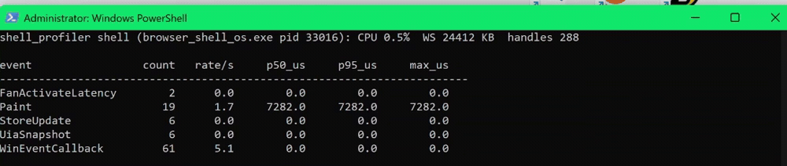
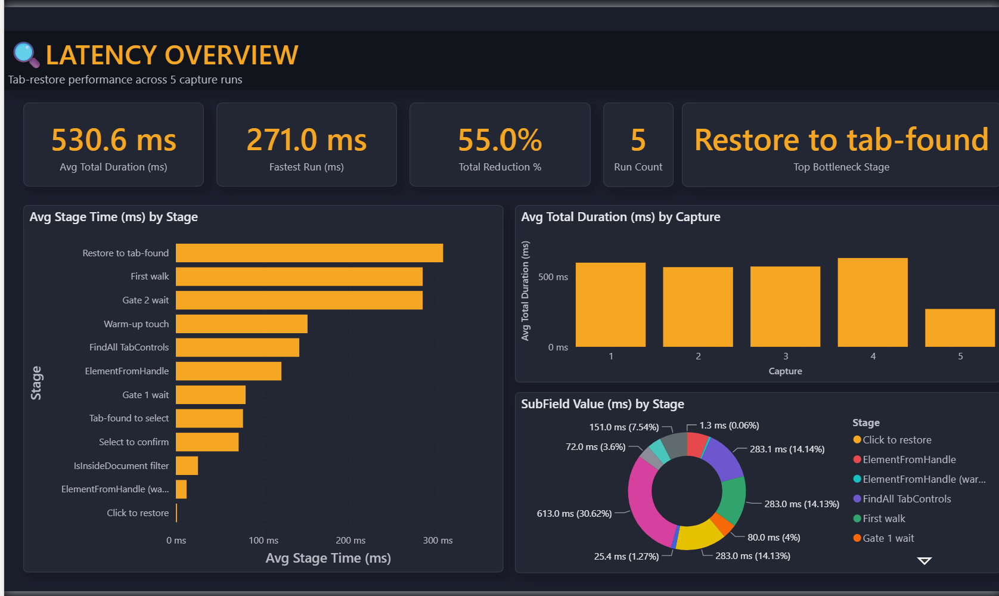

# shell_profiler

Standalone ETW consumer that measures `Peekbar` performance. Separate
executable, separate build target: never bundled with the shell (hard rule 8).

The only coupling is the ETW **provider name** `Peekbar.Perf` and the
**event/field names**, declared independently in `Contract.h`. No shell source
or header is included.

## What it does

- Starts a private real-time ETW session and enables the shell's TraceLogging
  provider, subscribed by the **name-derived GUID** (computed at runtime, so no
  hardcoded GUID can drift from the name).
- Decodes the self-describing TraceLogging events with TDH (no manifest).
- Live console table per event: count, rate/s, and p50/p95/max of `duration_us`.
- Samples the shell process alongside: CPU %, working set, handle count.
- `--csv <path>`: one row per interval for offline analysis.

## From capture to dashboard

`shell_profiler`'s live console table during a fan-activate session, counts accumulating as tabs restore:

<p align="center">
  <br>
  <em>Live metrics table (event / count / rate / p50 / p95 / max). Counts climb as fan-activate events fire.</em>
</p>

A representative raw per-click capture is committed at [`captures/fan_activate_breakdown_long.csv`](captures/fan_activate_breakdown_long.csv) (one baseline run, 7 clicks). These `FanActivateLatency` captures are the pre-ring-hop UIA-walk baseline; they feed a git-diffable Power BI dashboard:

<p align="center">
  <br>
  <em>The latency dashboard, built on this profiler's output. Full analysis: <a href="../docs/dashboard/">docs/dashboard/</a>.</em>
</p>

## Build

Two targets in one CMake project. Build just the profiler (shell target idle):

```
cmake -B build -G "Visual Studio 17 2022"
cmake --build build --config Debug --target shell_profiler
```

Or fully standalone, no shell in the tree at all:

```
cmake -B build-profiler -G "Visual Studio 17 2022" profiler
cmake --build build-profiler --config Debug
```

## Run

```
build\Debug\shell_profiler.exe [--raw] [--csv out.csv] [--image peekbar.exe] [--provider Peekbar.Perf]
```

- `--raw` prints each decoded event as it arrives instead of the metrics table.
- Ctrl+C stops the session cleanly (`ControlTraceW(EVENT_TRACE_CONTROL_STOP)`);
  the real-time session is never leaked.

## Privileges

Real-time ETW sessions require **elevation** or membership in the
**Performance Log Users** group (standard ETW rule, documented, not worked
around). Without it, `StartTraceW`/`EnableTraceEx2` return `ERROR_ACCESS_DENIED`
(5) and the profiler reports it and exits.

## Current status

Builds green; live capture is working. The shell emits `Peekbar.Perf`
events (`src/Trace.h` / `src/Trace.cpp`, wired across the fan / tab-read / store
paths), and the profiler has decoded them live from the running shell.

The live tab-activation latency event is now `KeystrokeHopLatency` (the ring-hop
keystroke path that replaced the UIA walk). The `FanActivateLatency` captures
behind the latency dashboard in [`docs/dashboard/`](../docs/dashboard/) are the
earlier UIA-era baseline, retained as the historical record of that optimization
work. Consumer, session lifecycle, TDH decode, metrics, and CSV are all
implemented.
